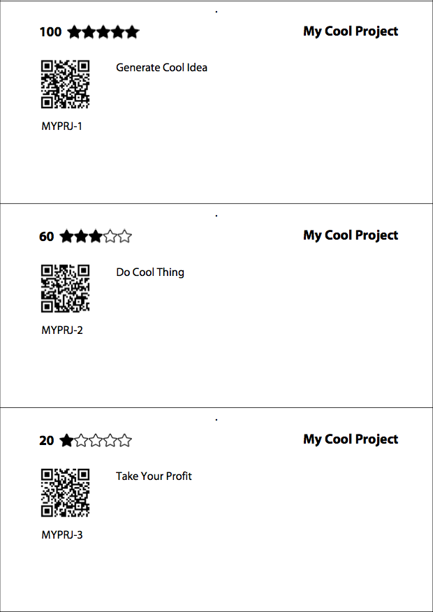

# YTickers
With YTickers you can easily convert CSV file with issues exported from YouTrack to agile-board stickers.

### Dependencies
Python 2.7 and `pip` are required.
Libraries are accessed via `pip`:

- xhtml2pdf
- jinja2
- qrcode
- pillow

### Configuration
Script configuration is `config.py` file. Feel free to customize it:

```python
config = {
    'yt_host': 'youtrack.com',

    'fields': {
        'id': 'Issue Id',
        'project': 'Subsystem',
        'title': 'Summary',
        'importance': 'Importance'
    }
}
```

First of all you need to redefine `yt_host` property. 
It will be used for generating QR-codes with direct links to issues.
Then specify all four required `fields` if they differ from your YT configuration.
However if you have an extra fields in exported csv they will be ignored by script.

### CSV input file
For example you have uploaded bunch of issues from YT to file `issues.csv`:
```
"Issue Id","Subsystem","Summary","Importance"
"MYPRJ-1","My Cool Project","Generate Cool Idea","100"
"MYPRJ-2","My Cool Project","Do Cool Thing","60"
"MYPRJ-3","My Cool Project","Take Your Profit","20"
```

### Running script
Then just type in the project root:
```
./ytickers /path/to/issues.csv
```

### PDF output
And your fantastic result will be placed here `tmp/out/` and looks like:


